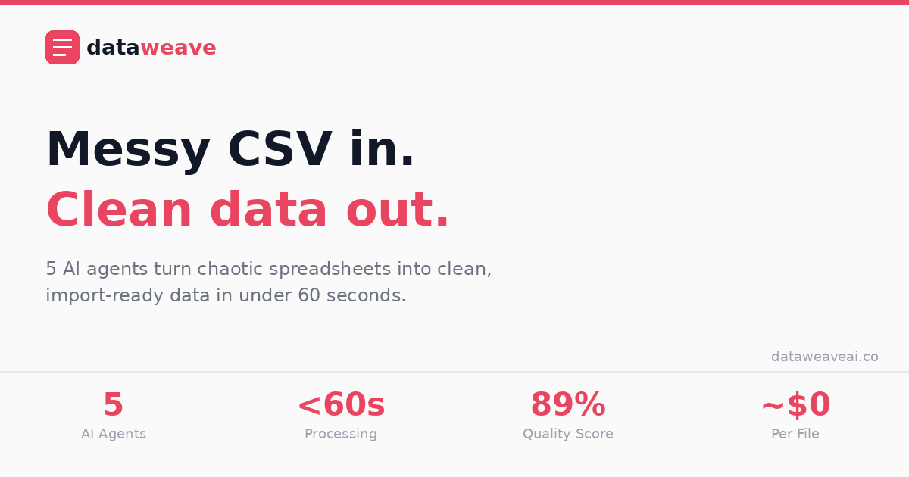

<div align="center">

# DataWeave AI

### Messy CSV in. Clean data out.

A multi-agent AI platform that transforms messy, inconsistent data files into clean, schema-compliant datasets — in under 60 seconds.

**Upload a file. Pick a schema. Let 5 AI agents do the rest.**

[](https://dataweaveai.co)
[](https://dataweave-ai-production-8516.up.railway.app/docs)
[](#test-results)
[](#license)

<br/>



</div>

---

## Table of Contents

- [The Problem](#the-problem)
- [How It Works](#how-it-works)
- [Architecture: 5 AI Agents](#architecture-5-ai-agents)
- [Key Features](#key-features)
- [Custom Schema Builder](#custom-schema-builder)
- [Pattern Learning System](#pattern-learning-system)
- [Data Privacy](#data-privacy)
- [Test Results](#test-results)
- [Tech Stack](#tech-stack)
- [API Reference](#api-reference)
- [Project Structure](#project-structure)
- [Running Locally](#running-locally)
- [Cost Analysis](#cost-analysis)
- [Roadmap](#roadmap)
- [License](#license)

---

## The Problem

Every company that migrates data between systems faces the same nightmare:

- Column names don't match (`Cust Email` → `email`, `Signup Date` → `created_at`)
- Date formats are inconsistent (`01/15/2024`, `15-Jan-2024`, `2024.01.15`)
- Phone numbers are chaos (`555.0102`, `(555) 010-3`, `+44-20-5555-0105`)
- Zip codes lose leading zeros (`09073` becomes `9073`)
- Required fields are randomly missing
- Manual cleanup takes **hours per file** — and repeats every time

Enterprise tools like Flatfile ($800+/mo) and OneSchema solve this for teams with engineering resources to embed SDKs. But they're overkill for the 90% of data work that happens outside of product teams.

**DataWeave AI is for:**
- The consultant cleaning client data on a Tuesday afternoon
- The RevOps team doing a CRM migration with no engineers
- The analyst who just needs their CSV to not be broken
- The agency importing data across 5 different client platforms

---

## How It Works

```
Upload messy file → AI maps columns → Human reviews → Download clean data
```

| Step | What Happens | Time |
|------|-------------|------|
| **1. Upload** | Drag and drop your CSV, Excel, JSON, or TSV file. Select a target schema (built-in or custom). | 5 sec |
| **2. Review** | 5 AI agents parse, map, and propose column mappings. You approve, reject, or correct with one click. | 30 sec |
| **3. Export** | Agents transform and validate every row. Download clean, schema-compliant CSV or JSON. | Instant |

The full pipeline runs asynchronously with real-time progress tracking. A live stepper shows which agent is currently working.

---

## Architecture: 5 AI Agents

DataWeave's intelligence is split across five specialized agents. Each handles a single responsibility. **4 of the 5 agents are fully deterministic and cost $0.00 to run.** Only the Schema Agent calls an LLM — and only for columns it hasn't seen before.

```
┌──────────────────────────────────────────────────────────────────────────────┐
│                           DataWeave Pipeline                                 │
│                                                                              │
│  ┌───────────┐   ┌───────────┐   ┌───────────┐   ┌───────────┐   ┌─────────┐│
│  │ Ingestion │──▶│  Pattern  │──▶│  Schema   │──▶│ Transform │──▶│Validate ││
│  │   Agent   │   │   Agent   │   │   Agent   │   │   Agent   │   │  Agent  ││
│  │           │   │           │   │           │   │           │   │         ││
│  │  $0.00    │   │  $0.00    │   │ ~$0.01    │   │  $0.00    │   │  $0.00  ││
│  │  No LLM   │   │  No LLM   │   │ LLM only  │   │  No LLM   │   │  No LLM ││
│  │           │   │           │   │ for new   │   │           │   │         ││
│  │ Parse any │   │ Match from│   │ columns   │   │ Normalize │   │ Quality ││
│  │ file type │   │ memory    │   │           │   │ all data  │   │  gate   ││
│  └───────────┘   └───────────┘   └───────────┘   └───────────┘   └─────────┘│
│                                                                              │
│  Total cost per file: ~$0.01 (decreasing toward $0 as patterns learn)        │
└──────────────────────────────────────────────────────────────────────────────┘
```

### Agent 1 — Ingestion Agent `$0.00`

Parses raw files into structured DataFrames with full type inference.

| Capability | Details |
|-----------|---------|
| **Formats** | CSV, XLSX (multi-sheet), JSON (arrays + nested), TSV |
| **Encoding** | Auto-detection via chardet — UTF-8, Latin-1, Windows-1252, BOM markers |
| **Delimiters** | Comma, semicolon, tab, pipe (auto-sniffed) |
| **Type inference** | integer, float, date, boolean, email, phone, zipcode, string |
| **Cleanup** | Normalizes nulls (N/A, null, none, --, empty), strips whitespace, drops unnamed columns |

### Agent 2 — Pattern Agent `$0.00`

The learning engine. Checks every column against a database of known mappings before anything touches an LLM.

- **120+ pre-seeded patterns** covering common CRM, e-commerce, and SaaS fields
- **Normalization:** `First Name`, `first_name`, `firstName`, `FIRST_NAME` all resolve to the same pattern
- **Adaptive learning:** Every user approval, rejection, and correction adjusts confidence scores automatically
- **Hit rate:** 67% on first upload, trending toward 90%+ with usage
- **Cost:** $0.00 — pure database lookup

### Agent 3 — Schema Agent `~$0.01`

The only agent that calls an LLM. Handles columns the Pattern Agent can't resolve.

| Feature | Implementation |
|---------|---------------|
| **Primary LLM** | Claude 3.5 Sonnet (Anthropic) |
| **Fallback LLM** | Gemini 2.0 Flash (Google, free tier) |
| **Batching** | All unknown columns sent in a single prompt — not one API call per column |
| **Caching** | In-memory response cache prevents duplicate calls within the same session |
| **Confidence** | Hybrid scoring: LLM confidence + heuristic boosts (exact name match +15, type match +10, pattern history +20) |
| **Cost** | ~$0.01 per file for 5 unknown columns. Approaches $0 as Pattern Agent learns. |

### Agent 4 — Transform Agent `$0.00`

Applies approved mappings to the actual data. Pure Python/Pandas — no LLM.

| Transform | What It Does | Example |
|-----------|-------------|---------|
| `rename` | Maps source column to target field | `Cust Email` → `email` |
| `split_name` | Splits full name into first + last | `Kathryn Williams` → `Kathryn` / `Williams` |
| `parse_date` | Normalizes 15+ date formats to ISO 8601 | `15-Jan-2024` → `2024-01-15` |
| `phone_normalize` | Standardizes phone formats | `(555) 010-3` → `+15550103` |
| `email_normalize` | Lowercases, validates format | `John.DOE@Acme.COM` → `john.doe@acme.com` |
| `zip_pad` | Restores leading zeros on short zip codes | `9073` → `09073` |
| `cast_integer` | Handles commas and currency | `$1,234` → `1234` |
| `cast_float` | Parses decimal values | `1,234.56` → `1234.56` |
| `cast_boolean` | Normalizes boolean representations | `yes` / `on` / `1` / `active` → `true` |
| `titlecase` | Capitalizes properly | `john doe` → `John Doe` |
| `passthrough` | Copies value as-is | Direct copy with no modification |

### Agent 5 — Validation Agent `$0.00`

The quality gate. Checks every row against the target schema and produces a quality score.

**Three-tier severity system:**

| Tier | What It Catches | Impact on Score |
|------|----------------|----------------|
| **Error** | Missing required fields, wrong types, invalid formats (bad email, short phone) | Reduces score |
| **Warning** | Duplicate values on unique fields, >50% empty columns | Minor deduction (max 10 pts) |
| **Info** | Schema fields with no source data, statistical outliers (3×IQR) | No impact |

The quality score formula: `(rows_with_zero_errors / total_rows) × 100 - warning_deductions`

This means unmapped fields (fields in the target schema that don't exist in your source file) will never tank your score. They show up as info messages, not errors.

---

## Key Features

### Human-in-the-Loop Review

Every AI-proposed mapping goes through human review before any data is transformed.

- **One-click approve/reject** for individual mappings
- **Bulk approve** all mappings above 85% confidence
- **Manual correction** — override the AI's suggestion with a different target field
- **Confidence indicators** — color-coded (green ≥90%, yellow ≥75%, red <75%) so you can focus review on the uncertain ones

### Async Pipeline with Real-Time Progress

The pipeline runs asynchronously after upload. A live processing page shows:

- Which agent is currently running (with animated stepper)
- Progress percentage and elapsed time
- Automatic redirect to review page when mapping is complete

### Before & After

**Input (messy CSV):**
```
Cust Email, Full Name, Signup Date, Phone #, Org, Zip
john.doe@acmecorp.com, John Doe, 01/15/2024, 555.0101, Acme Corp, 9073
roberto@techstart.mx, Roberto García, 03-Feb-2024, (555) 010-3, TechStart, 04555
```

**Output (clean, schema-compliant):**
```
email, first_name, last_name, created_at, phone, company, zip_code
john.doe@acmecorp.com, John, Doe, 2024-01-15, +15550101, Acme Corp, 09073
roberto@techstart.mx, Roberto, García, 2024-02-03, +15550103, TechStart, 04555
```

---

## Custom Schema Builder

Not limited to pre-built CRM schemas. Define your own target format for any use case.

### How It Works

1. Name your schema and add a description
2. Add fields manually or use **quick-add presets** (Contact Info, Company Info, Address, Metadata)
3. Configure each field: name, type, required/unique flags, format rules, description
4. **Drag-and-drop reorder** fields to match your preferred output column order
5. **Live JSON preview** shows the exact schema structure as you build
6. Save → immediately available in the upload page

### Field Configuration

| Property | Options |
|----------|---------|
| **Type** | string, integer, float, date, boolean, email |
| **Format** | email, phone, URL, zipcode, ISO 8601 |
| **Constraints** | required, unique |
| **Description** | Helps the AI map ambiguous columns (e.g., "Customer's primary email address") |

### Example Use Cases

| Schema | Fields |
|--------|--------|
| **CRM Contacts** | first_name, last_name, email, phone, company, city, state, zip_code |
| **Sales Orders** | first_name, last_name, company, order_amount, order_date, order_status, product_line, deal_size |
| **Patient Records** | patient_id, first_name, last_name, dob, insurance_id, provider, diagnosis_code |
| **E-commerce Products** | sku, product_name, category, price, stock_quantity, weight, description |

The Schema Agent uses field names, types, and descriptions to intelligently map your source columns — even when column names don't match at all (`CONTACTFIRSTNAME` → `first_name`).

---

## Pattern Learning System

This is DataWeave's competitive moat. The system gets cheaper and faster with every file processed.

```
File  1:  15 columns → 0 pattern matches  → 15 LLM calls  → ~$0.15
File  5:  15 columns → 8 pattern matches  → 7 LLM calls   → ~$0.07
File 20:  15 columns → 12 pattern matches → 3 LLM calls   → ~$0.03
File 50:  15 columns → 14 pattern matches → 1 LLM call    → ~$0.01
```

### Three layers of intelligence

```
┌─────────────────────────────────────────────┐
│  Layer 1: User Corrections (highest trust)  │
│  Approved/rejected/corrected by humans      │
├─────────────────────────────────────────────┤
│  Layer 2: Global Patterns (baseline)        │
│  120+ pre-seeded common field mappings      │
├─────────────────────────────────────────────┤
│  Layer 3: LLM Fallback (expensive)          │
│  Claude / Gemini — used less over time      │
└─────────────────────────────────────────────┘
```

Every approval increases a pattern's confidence. Every rejection decreases it. Every correction creates a new, higher-priority pattern. The system converges toward near-zero AI costs over time.

---

## Data Privacy

DataWeave is designed with privacy as a default, not an afterthought.

| Concern | How We Handle It |
|---------|-----------------|
| **Row data** | Processed in-memory only. Never written to disk. Never sent to any LLM. |
| **What the LLM sees** | Column names + 5 sample values (for type inference). Never full rows or PII. |
| **File storage** | Files are held in memory during processing and discarded after export. |
| **Database** | Only metadata is persisted: column names, mapping decisions, quality scores. No row-level data. |
| **Third-party sharing** | None. No analytics, no tracking, no data brokers. |

Your actual data never leaves the processing pipeline. The LLM only sees structural metadata needed to propose column mappings.

---

## Test Results

**200 tests passing** across all agents, transforms, validation rules, and integration flows.

| Test Suite | Tests | Coverage |
|-----------|-------|----------|
| Ingestion Agent | 10 | File parsing, encoding, type inference |
| Transform Agent | 30 | All 11 transform types, edge cases, null handling |
| Validation Agent | 17 | Required fields, type checks, formats, duplicates, anomalies |
| Schema Builder | 25 | Field normalization, CRUD, duplication, snake_case conversion |
| Sanitizer | 20 | Prompt injection prevention across all agents |
| Job Manager | 24 | Async pipeline states, progress tracking, error handling |
| Kaggle Integration | 16 | 1,000-row simulated data, international formats, edge cases |
| Kaggle Real Data | 28 | 777-row customer dataset: zip padding, name splitting, duplicates |
| API Routes | 30 | Upload, review, approve, reject, complete, export flows |

### Real-World Validation

Tested against real-world datasets with production-grade messiness:

| Dataset | Rows | Columns | Issues Found | Result |
|---------|------|---------|-------------|--------|
| Customer contacts | 777 | 10 | 80 short zip codes, 4 missing phones, duplicate emails, trailing whitespace in states | All zips padded, names split, duplicates flagged. Quality score: 91.2% |
| Sales orders | 2,823 | 25 | 1,500 null states, uppercase column names, international addresses, mixed currencies | All 14 target fields mapped correctly. Custom schema handled perfectly. |

---

## Tech Stack

| Layer | Technology |
|-------|-----------|
| **Backend** | Python 3.13, FastAPI, Uvicorn, Pandas |
| **Frontend** | Next.js 16, TypeScript, Tailwind CSS |
| **Database** | PostgreSQL (Supabase) |
| **Primary LLM** | Anthropic Claude 3.5 Sonnet |
| **Fallback LLM** | Google Gemini 2.0 Flash |
| **Backend Hosting** | Railway |
| **Frontend Hosting** | Vercel |
| **Domain** | dataweaveai.co |

### Database Schema (7 Tables)

```sql
target_schemas    -- Schema definitions (built-in + custom) with field specs
schema_fields     -- Individual field definitions per schema (type, format, constraints)
patterns          -- Learned column mappings (120+ pre-seeded, grows with usage)
jobs              -- Pipeline state machine (upload → ingest → map → review → complete)
columns           -- Detected column profiles per job
mappings          -- AI proposals + human decisions (approve/reject/correct)
events            -- Agent activity log (which agent did what, when, how long)
```

---

## API Reference

Full interactive docs at [`/docs`](https://dataweave-ai-production-8516.up.railway.app/docs) (Swagger UI).

### Pipeline Lifecycle

| Method | Endpoint | Description |
|--------|----------|-------------|
| `POST` | `/api/upload` | Upload file + start async pipeline (ingest → map) |
| `GET` | `/api/jobs/{id}/status` | Poll pipeline progress (stage, %, elapsed time) |
| `GET` | `/api/jobs/{id}/result` | Fetch mapping results after pipeline completes |
| `POST` | `/api/jobs/{id}/complete` | Run Phase 2 (transform → validate → export) |

### Human-in-the-Loop Review

| Method | Endpoint | Description |
|--------|----------|-------------|
| `GET` | `/api/jobs/{id}/mappings` | Get all proposed mappings |
| `POST` | `/api/jobs/{id}/mappings/{mid}/approve` | Approve a mapping |
| `POST` | `/api/jobs/{id}/mappings/{mid}/reject` | Reject a mapping |
| `POST` | `/api/jobs/{id}/mappings/{mid}/correct` | Override with different target field |
| `POST` | `/api/jobs/{id}/mappings/approve-all` | Bulk approve all ≥85% confidence |

### Schemas

| Method | Endpoint | Description |
|--------|----------|-------------|
| `GET` | `/api/schemas` | List all schemas (built-in + custom) |
| `GET` | `/api/schemas/custom` | List custom schemas with field counts |
| `POST` | `/api/schemas/custom` | Create a new custom schema |
| `DELETE` | `/api/schemas/{id}` | Delete a custom schema |
| `POST` | `/api/schemas/{id}/duplicate` | Duplicate a schema (system or custom) |

### Diagnostics

| Method | Endpoint | Description |
|--------|----------|-------------|
| `GET` | `/api/jobs/{id}` | Job metadata and status |
| `GET` | `/api/jobs/{id}/columns` | Detected column profiles |
| `GET` | `/api/jobs/{id}/events` | Agent activity log |
| `GET` | `/api/stats/patterns` | Pattern hit rate and LLM usage stats |

---

## Project Structure

```
dataweave-ai/
├── backend/
│   ├── agents/
│   │   ├── ingestion.py        # File parsing, encoding detection, type inference
│   │   ├── pattern.py          # Pattern matching, confidence scoring, learning
│   │   ├── schema.py           # LLM routing, column mapping, caching
│   │   ├── transform.py        # Data normalization (dates, phones, emails, zips)
│   │   └── validation.py       # Quality checks, scoring, 3-tier severity
│   ├── core/
│   │   ├── llm_router.py       # Claude → Gemini fallback with retry logic
│   │   └── orchestrator.py     # Async pipeline state machine, file cache
│   ├── api/
│   │   └── routes.py           # FastAPI endpoints (20+)
│   ├── tests/
│   │   ├── test_ingestion.py
│   │   ├── test_transform.py
│   │   ├── test_validation.py
│   │   ├── test_schema_builder.py
│   │   ├── test_sanitizer.py
│   │   ├── test_job_manager.py
│   │   ├── test_kaggle_integration.py
│   │   ├── test_kaggle_customers.py
│   │   └── test_api_routes.py
│   ├── main.py
│   └── requirements.txt
├── frontend/
│   ├── public/
│   │   ├── favicon.ico
│   │   └── og-image.png
│   └── src/
│       ├── components/
│       │   ├── ThemeProvider.tsx   # Light/dark mode with localStorage
│       │   └── Footer.tsx         # Copyright + links
│       ├── styles/
│       │   └── theme.css          # CSS variables for light/dark themes
│       └── app/
│           ├── layout.tsx         # Root layout with ThemeProvider
│           ├── page.tsx           # Landing page
│           ├── upload/page.tsx
│           ├── processing/[jobId]/page.tsx
│           ├── review/[jobId]/page.tsx
│           ├── results/[jobId]/page.tsx
│           ├── schemas/page.tsx
│           └── schemas/new/page.tsx
├── LICENSE
└── README.md
```

---

## Running Locally

### Prerequisites

- Python 3.11+
- Node.js 18+
- Supabase account (free tier works)
- Anthropic API key (for Schema Agent)

### Backend

```bash
cd backend
python -m venv venv
source venv/bin/activate    # Windows: venv\Scripts\activate
pip install -r requirements.txt

# Create .env
cat > .env << EOF
SUPABASE_URL=your_supabase_url
SUPABASE_SERVICE_KEY=your_service_key
ANTHROPIC_API_KEY=your_claude_key
GEMINI_API_KEY=your_gemini_key    # Optional fallback
EOF

# Run
uvicorn main:app --reload --port 8000
```

### Frontend

```bash
cd frontend
npm install

# Create .env.local
echo "NEXT_PUBLIC_API_URL=http://localhost:8000" > .env.local

# Run
npm run dev
```

Open [http://localhost:3000](http://localhost:3000)

### Run Tests

```bash
cd backend
python -m pytest tests/ -v    # 200 tests, all passing
```

---

## Cost Analysis

### Per-File Cost

| Component | Cost | Notes |
|-----------|------|-------|
| Ingestion Agent | $0.00 | Pure Python file parsing |
| Pattern Agent | $0.00 | Database lookup only |
| Schema Agent | ~$0.01 | Single batched LLM call for unknown columns |
| Transform Agent | $0.00 | Pandas operations |
| Validation Agent | $0.00 | Deterministic rule checks |
| **Total per file** | **~$0.01** | **Decreases as patterns learn** |

### Monthly Infrastructure

| Service | Cost | Tier |
|---------|------|------|
| Supabase (PostgreSQL) | $0 | Free |
| Railway (backend) | $5–$20 | Usage-based |
| Vercel (frontend) | $0 | Free |
| Custom domain | $1 | Annual |
| Claude API | $5–$40 | Volume-dependent |
| **Total** | **$11–$61/mo** | |

---

## Capacity & Limits

| Parameter | Limit |
|-----------|-------|
| Maximum file size | 10 MB |
| CSV rows per 10 MB | 50,000–200,000 |
| Excel rows per 10 MB | 30,000–100,000 |
| JSON records per 10 MB | 20,000–80,000 |
| Comfortable range | 10,000–50,000 rows |
| Maximum columns | 50 per file |
| Date format support | 15+ formats auto-detected |
| Processing time | <60 seconds for most files |

---

## Roadmap

### Shipped ✅

- [x] 5-agent pipeline (Ingestion → Pattern → Schema → Transform → Validation)
- [x] Human-in-the-loop review (approve / reject / correct)
- [x] Pattern learning system (120+ pre-seeded, grows with usage)
- [x] LLM routing with fallback (Claude → Gemini)
- [x] Async pipeline with real-time progress tracking
- [x] Custom Schema Builder with drag-and-drop, presets, live preview
- [x] 3-tier validation severity (errors / warnings / info)
- [x] Name splitting transform (`Full Name` → `first_name` + `last_name`)
- [x] Zip code padding (`9073` → `09073`)
- [x] Light / dark theme with toggle
- [x] 200 tests across all agents and flows
- [x] Full API with 20+ endpoints
- [x] Landing page with waitlist
- [x] Deployed (Railway + Vercel + Supabase)

### Planned 🔜

- [ ] User authentication (Supabase Auth)
- [ ] Per-user pattern pools
- [ ] Batch upload (multiple files, same schema)
- [ ] Webhook callbacks for pipeline completion
- [ ] Export to Google Sheets / Airtable
- [ ] Amazon Bedrock integration (multi-model support)
- [ ] Pattern dashboard (hit rates, learned mappings, cost tracking)
- [ ] Column merge/split transforms (address splitting, field concatenation)
- [ ] Fine-tuned mapping model (replace LLM calls entirely)

---

## Contributing

DataWeave AI is source-available. Contributions for personal and educational use are welcome.

1. Fork the repository
2. Create a feature branch (`git checkout -b feature/your-feature`)
3. Run the test suite (`python -m pytest tests/ -v`)
4. Commit your changes
5. Open a pull request

For commercial licensing inquiries, reach out via [LinkedIn](https://linkedin.com/in/sam-agarwal-ai/).

---

## Built By

**Samyak Agarwal** — Applied AI Engineer

[](https://linkedin.com/in/sam-agarwal-ai/)
[](https://dataweaveai.co)

---

## License

**Source Available License.** Free for personal and educational use. Commercial use requires written permission from the author. See [LICENSE](LICENSE) for full terms.

© 2026 Samyak Agarwal. All rights reserved.
